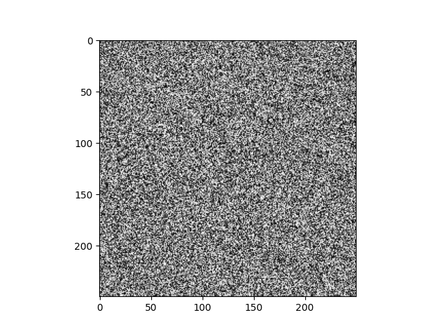

# Mersenne-Twister
A C implementation of the MT19937 and MT19937-64. Both implementations intend to match the original paper's C implementation

## Usage

### MT19937.c
```c
#include <stdio.h>
#include <time.h>
#include "MT19937.h"

int main(void){
    MT19937 mt;
    // Seed Mersenne Twister
    SeedMT(time(NULL), &mt);

    // Generate 10 Natural Numbers
    for (int i = 0; i < 10; ++i){
        printf("%lf ", MT_GenNat(&mt));
    }
    printf("\n");

    // Generate 10 Real Numbers in the range [0, 1]
    for (int i = 0; i < 10; ++i){
        printf("%lf ", MT_GenReal(&mt));
    }
}
```

## 250x250 Random Noise Generated by the MT19937 implementation


## The Original Paper
[Mersenne Twister: A 623-dimensionally equidistributed uniform pseudorandom number generator](http://www.math.sci.hiroshima-u.ac.jp/m-mat/MT/ARTICLES/mt.pdf)

*C program on page 22*

### Original MT19937-64 C Code 
[A C-program for MT19937-64](http://www.math.sci.hiroshima-u.ac.jp/m-mat/MT/VERSIONS/C-LANG/mt19937-64.c)

## Additional Resources
[Wikipedia](https://en.wikipedia.org/wiki/Mersenne_Twister)
